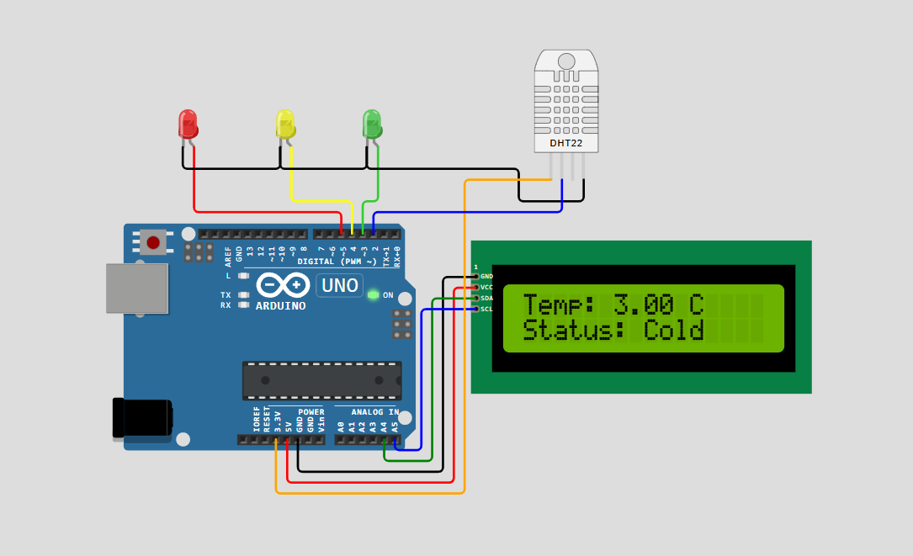

# 🌡️ Arduino Temperature Monitor with DHT22 + LCD + LEDs

This project reads ambient temperature using the DHT22 sensor and displays it on a 16x2 I2C LCD. It also provides a visual status using three LEDs based on temperature range.

---

## 🚀 Features

- Read accurate temperature with DHT22 sensor
- Display temperature on 16x2 I2C LCD
- LED indicators:
  - 🟢 Green for Cold (≤ 20°C)
  - 🟡 Yellow for Warm (21–30°C)
  - 🔴 Red for Hot (> 30°C)

---

🖼️ Preview

---

## 🧰 Components Required

| Component           | Quantity |
|--------------------|----------|
| Arduino UNO / Nano | 1        |
| DHT22 Temperature Sensor | 1   |
| 16x2 I2C LCD       | 1        |
| LED (Red, Yellow, Green) | 1 each |
| 220Ω Resistors     | 3        |
| Breadboard + Wires | 1 set    |

---

## 🔌 Wiring Diagram

| Component   | Pin         | Arduino Pin |
|-------------|-------------|-------------|
| DHT22       | Vcc         | 5V          |
|             | GND         | GND         |
|             | Data        | D2          |
| LCD (I2C)   | SDA         | A4 (UNO)    |
|             | SCL         | A5 (UNO)    |
| Green LED   | Anode       | D3          |
| Yellow LED  | Anode       | D4          |
| Red LED     | Anode       | D5          |

> ⚠️ Use 220Ω resistor in series with each LED anode.

---

## 📦 Libraries Used
- Install via Arduino Library Manager:
- DHT sensor library by Adafruit
- Adafruit Unified Sensor
- LiquidCrystal_I2C by Frank de Brabander (or compatible)

---

## 🧪 Test Conditions
|Temperature (°C)|	LED |	LCD Status |
|----------------|------|------------|
|≤ 20|	Green	|Cold |
|21 – 30	|Yellow	|Warm |
|> 30	|Red	|Hot |
